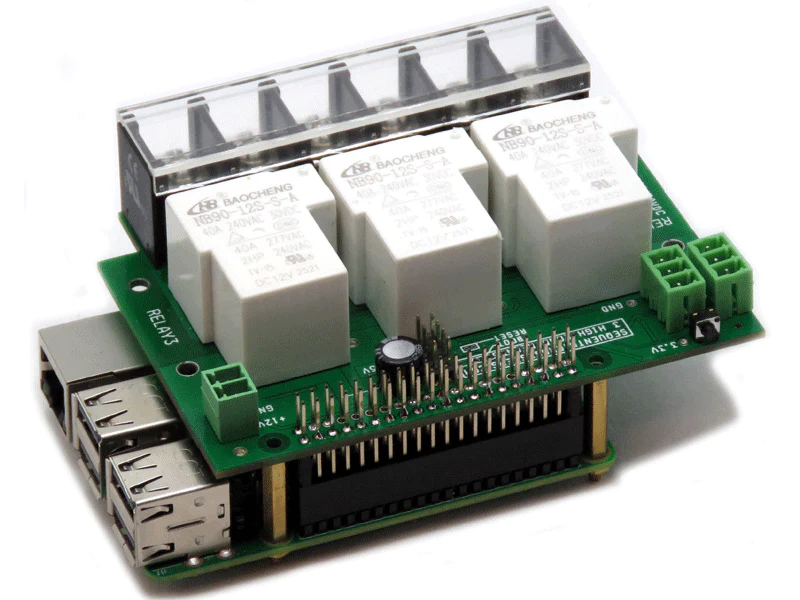

[](https://sequentmicrosystems.com)

[](https://sequentmicrosystems.com/collections/all-io-cards/products/three-40a-240v-relays-rs485-for-raspberry-pi)

# 3relind-rpi
Drivers for Sequent Microsystems [Three 40A/240V Relays RS485 Daisy-chainable HAT for Raspberry Pi](https://sequentmicrosystems.com/collections/all-io-cards/products/three-40a-240v-relays-rs485-for-raspberry-pi)

## Setup (first usage of a Sequent Microsystems card)
 - Enable the I2C communication:
```bash
~$ sudo raspi-config
```
Go to the "Interface Options">>"I2C" menu and select "Yes"

 - Enable UART communication:
```bash
~$ sudo raspi-config
```
Go to the "Interface Options">>"Serial Port" 
Select "No" for login sell acces over serial
Select "Yes" for enable serial port hardware.

 - Update your Raspberry PI and install the tools you need:
 ```bash
~$ sudo apt-get udate
~$ sudo apt-get upgrade
~$ sudo apt-get install git
```

## Install
```bash
~$ git clone https://github.com/SequentMicrosystems/3relind-rpi.git
~$ cd 3relind-rpi/
~/3relind-rpi$ sudo make install
```

Now you can access all the functions of the relays board through the command "3relind". Use -h option for help:
```bash
~$ 3relind -h
```

If you clone the repository, any update can be made with the following commands:

```bash
~$ cd 3relind-rpi/  
~/3relind-rpi$ git pull
~/3relind-rpi$ sudo make install
```  

Many thanks to [stephane](https://github.com/stephane/libmodbus) and [dhruvvyas90](https://github.com/dhruvvyas90/libmodbus) for their great work on libmodbus software library and for letting us use it in our project.
