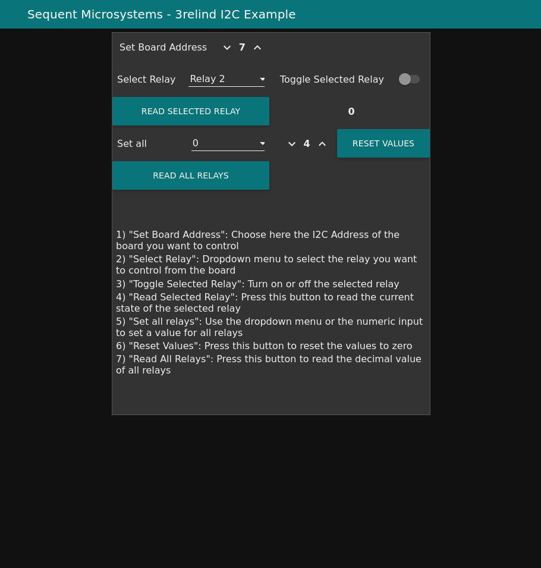

[](https://sequentmicrosystems.com)

# Node-RED Usage Examples
Node-RED usage examples for Sequent Microsystems [Three 40A/240V Relays RS485 Daisy-chainable HAT for Raspberry Pi](https://sequentmicrosystems.com/collections/all-io-cards/products/three-40a-240v-relays-rs485-for-raspberry-pi)


## Installing the software

* Install NodeRed following the instructions from [HERE](https://nodered.org/docs/getting-started/raspberrypi).

* Run ```sudo raspi-config``` and enable I2C communication and UART.
 - Go to the "Interface Options">>"I2C" menu and select "Yes"
 - Go to the "Interface Options">>"Serial Port".
 - Select "No" for login sell acces over serial.
 - Select "Yes" for enable serial port hardware.

* Update your Raspberry PI and reboot:
 ```bash
~$ sudo apt-get update
~$ sudo apt-get upgrade
~$ sudo reboot
```

* Connect one [Three 40A/240V Relays RS485 Daisy-chainable HAT for Raspberry Pi](https://sequentmicrosystems.com/collections/all-io-cards/products/three-40a-240v-relays-rs485-for-raspberry-pi) to your raspberry.

* Install the node for [Three 40A/240V Relays RS485 Daisy-chainable HAT for Raspberry Pi](https://sequentmicrosystems.com/collections/all-io-cards/products/three-40a-240v-relays-rs485-for-raspberry-pi) by opening the Node-RED interface in a browser: Go to Menu > Manage pallete > Install and search for node-red-contrib-sm-3relind, install the node and restart the Node-RED

* Import the example flow you want: Go to Menu > Import > select a file to import. Load the provided json file and click the Import button.

* Click on the top right ```Deploy``` button.

* Go to the dashboard at the following address in your web browser:
```bash
http://<raspberry-pi-IP-address>:1880/ui
```
where "raspberry-pi-IP-address" is the IP address of your Raspberry PI.

## Start using the example
 - "Set Board Address": Choose here the Address of the board you want to control
 - "Select Relay": Dropdown menu to select the relay you want to control from the board
 - "Toggle Selected Relay": Turn on or off the selected relay
 - "Read Selected Relay": Press this button to read the current state of the selected relay
 - "Set all relays": Use the dropdown menu or the numeric input to set a value for all relays
 - "Reset Values": Press this button to reset the values to zero
 - "Read All Relays": Press this button to read the decimal value of all relays

 